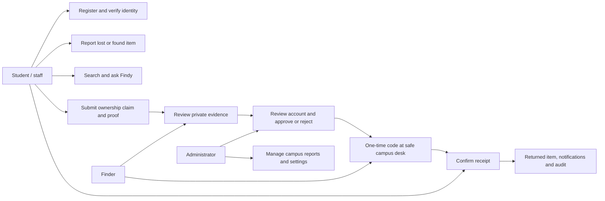
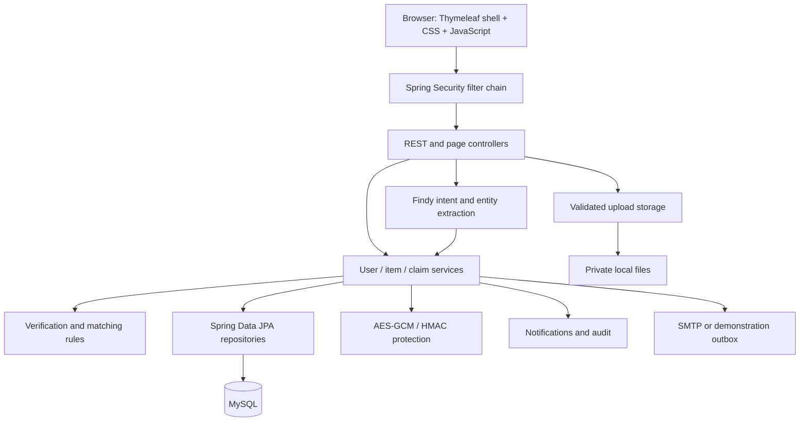
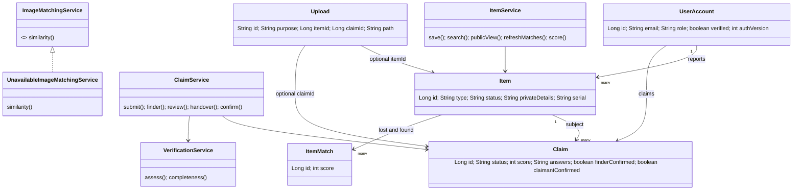
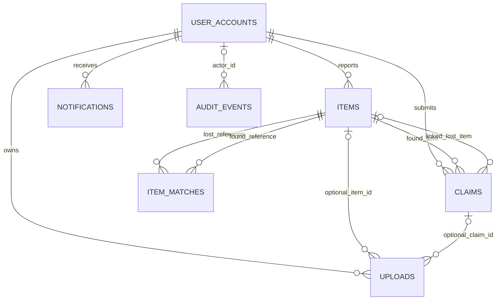
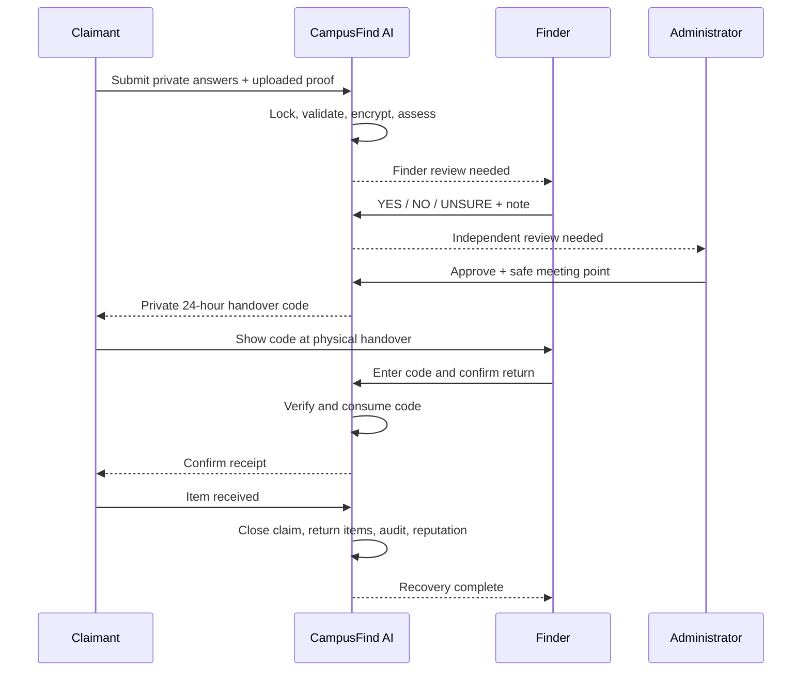
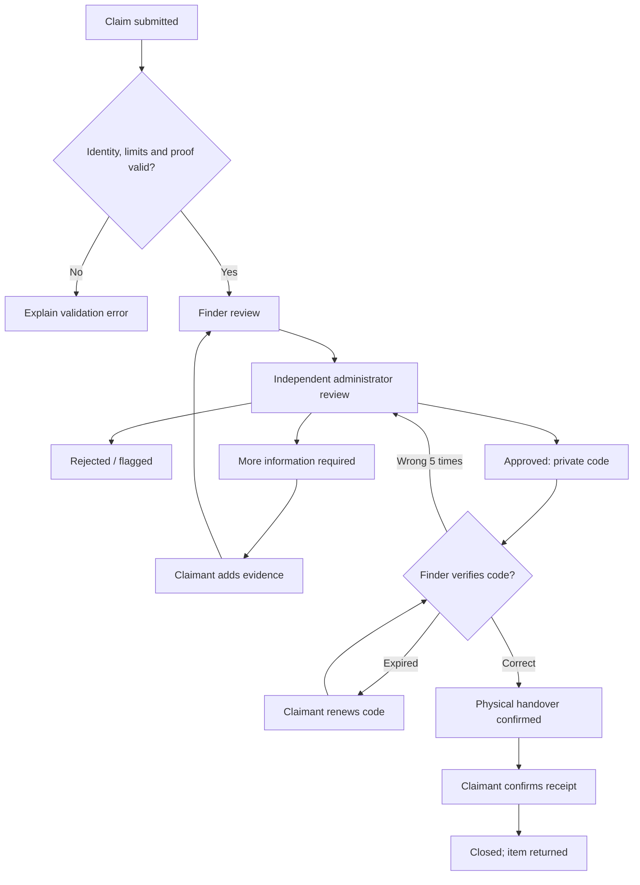

# CampusFind AI

## Lost on Campus. Found with Intelligence.

**Project type:** Java web application for a single college or university.  
**Implementation:** Java 21 target, Spring Boot 3.5.16, Spring MVC, Spring Security, JPA/Hibernate, MySQL 8, Thymeleaf, CSS and JavaScript.  
**Delivery:** local Windows installation, source, executable JAR, SQL, integration tests and demonstration guide.

## Abstract

CampusFind AI connects campus members who lose belongings with people who find them. It combines structured reporting and photo upload with contextual language search, explainable recommendations and a controlled ownership-verification workflow. Public descriptions contain general details; sensitive marks, serials and evidence are protected separately. A finder reviews a claim, an independent administrator makes the decision, and two people confirm the physical return through a one-time handover process. Notifications and an audit trail support accountability.

## Problem statement and existing system

Noticeboards, informal group messages and manually maintained registers spread reports across disconnected places. Search is inconsistent, old reports remain visible, private contact information can be exposed, and knowing a public description can be mistaken for ownership. A basic CRUD website improves record keeping but still lacks a reliable verification and return process.

The proposed system creates one campus record of reports, claims and returns. Its objectives are faster discovery, accurate state tracking, private ownership checks, accountable staff review and an accessible student interface. It makes recommendations without treating a similarity score as proof.

## Actors and use cases

Students, faculty and staff share the USER role. A finder and claimant are contextual roles in a particular report/claim. ADMIN access uses a separate portal and cannot be acquired through registration.

## Functional requirements and modules

| Module | Implemented behavior |
|---|---|
| Accounts | Any valid email domain, unique college ID/email, BCrypt, strength policy, separate portals, email and physical-ID verification |
| Reporting | Lost/found types; category, brand/model/color, value, date/time, campus location/building/floor/room; private marks and serial |
| Media | Up to five JPG/PNG photos; preview; 5 MB limit; pixel limit; PNG normalization; protected evidence/profile photos |
| Discovery | Multi-filter search, contextual Findy search, actual-record recommendations, match notifications |
| Claims | Proof, private statement, optional linked lost report/serial, verified identity, duplicate/active-count restrictions |
| Reviews | Finder YES/NO/UNSURE, independent administrator approval/rejection/more-evidence/flagging, account history |
| Return | 24-hour handover code, attempt limit, finder verification, claimant receipt, terminal states and reputation |
| Administration | User activation/flags/ID verification, report moderation, categories, locations, announcements and audit log |
| Personal area | Dashboard, own reports, claim timeline, notifications, profile/photo and password changes |

## Non-functional requirements

- **Privacy:** explicit response maps omit sensitive fields from public APIs; permission checks gate private images and claim detail.
- **Security:** authenticated encryption, BCrypt, CSRF, content-security policy, HttpOnly/SameSite session cookie, account lockout, input limits and permission checks.
- **Consistency:** transactional writes and pessimistic database locks for claims, approvals and handovers.
- **Usability:** responsive navigation, labelled forms, inline validation, empty/error states, readable item cards, keyboard focus and theme switching.
- **Maintainability:** controllers, services and repositories separated by responsibility; configurable campus domain/mail/storage; integration tests.
- **Deployability:** executable Spring Boot JAR, dedicated local MySQL setup, launch/stop scripts and sanitized submission archive.

## Architecture

Spring Security authenticates and authorizes requests before the controllers. Controllers accept typed records or validated form maps. Services apply business rules inside transactions. Repositories persist entities. Public DTO-style maps deliberately avoid direct serialization of account, item and claim entities.

## Class diagram

## Data design and ER diagram

| Table | Main data and constraints |
|---|---|
| user_accounts | Unique email and college ID, BCrypt hash, role, verification flags, account state/history, token hashes and authentication version |
| items | Reporter foreign key, lost/found type, public attributes, encrypted private attributes, state and timestamps |
| claims | Claimant/item/optional-lost foreign keys, encrypted answers, score/state, review notes, encrypted code plus keyed hash, confirmation timestamps |
| uploads | UUID, owner foreign key, purpose, optional item/claim references, private file path, media type and original name |
| item_matches | Lost/found references, score and timestamp, unique pair |
| notifications | Account reference, title/message, read flag and timestamp |
| audit_events | Actor ID, action, resource, IP, outcome and timestamp |
| categories / campus_locations | Unique configurable labels |
| announcements | Campus message title/body/time |

Lost and found reports intentionally share a typed table. Admin accounts share the authentication table but have a server-controlled role. Category and location labels are validated against their catalogs and cannot be removed while used. Upload item/claim references and audit actor IDs are scalar associations enforced in service code; other relationships use JPA foreign keys. The exact generated schema is provided in `sql/schema.sql`.

## Matching algorithm

For each newly created/edited report, compare eligible opposite-type reports. Score category equality (20), nonempty brand equality (15), nonempty color equality (10), exact configured location equality (15), date proximity (15/12/8/3/0 for within 1/3/7/30/more days), and public name/model/description token overlap (up to 15). Store pairs scoring at least 60. Notify the lost report's owner when a new pair appears. A current lost report can move to POSSIBLE_MATCH.

The final ten image points are reserved and not awarded. The maximum current report score is 90/100; a claim is never approved by this algorithm. The ImageMatchingService abstraction returns an empty result until a reviewed visual provider is integrated. Exact building proximity and advanced image recognition are future extensions rather than invented measurements.

## Natural-language search

Findy detects search/report/claim/help/private-information intents. Entity extraction recognizes catalog categories and common synonyms, brands, colors, campus locations and relative dates. Session context lets “Library” refine “I lost my calculator.” A new category/search replaces old context. The query filters actual open records and excludes returned, closed, removed and reserved found items. Results carry public DTOs only. Private-information requests receive a refusal with guidance toward formal ownership verification.

The system is rule-based, not trained generative AI. A finite supported vocabulary and simplified date/location reasoning are declared limitations. It runs locally without paid keys or an external inference service.

## Ownership verification algorithm

1. Require a verified, active, unflagged campus user and college ID. Lock the user row, enforce at most three active claims and one claim per user/item, then lock the found item.
2. Validate an ownership statement and actual stored proof images belonging to that user. Encrypt answers and serials. Link a lost report only if the claimant owns it.
3. Compute administrator triage: verified identity 15, history up to 5, statement detail up to 15, location consistency 15, private-description overlap up to 25, evidence attachment 10 and serial consistency up to 15. Partial serials need at least six characters. Presence is not image authentication.
4. Show the claimant an input-completeness score, not the hidden-answer score. This avoids repeatedly learning private attributes from changing feedback.
5. Obtain finder confirmation, then independent admin review. Every claim requires the administrator, so all high-value categories are covered. Self-review and finder-as-admin approval are rejected.
6. For approval, ensure another claim has not already reserved the item. Issue a random code, store an encrypted display copy and keyed comparison hash, expire after 24 hours and limit failed attempts to five. Errors commit attempt counts.
7. The finder enters the claimant's code at a staffed campus point. Consume the code. Only afterward may the claimant confirm receipt. Mark linked reports returned, close the claim, resolve competing claims, record audit events and award community points.

## Sequence diagram

## Activity and state flow

Unused transient example states in the original prompt are represented by timestamped audit steps rather than separate screen stops. The active claim stages are FINDER_REVIEW, ADMIN_REVIEW, MORE_INFORMATION_REQUIRED, APPROVED, ITEM_HANDOVER, REJECTED and CLOSED.

## Validation and error handling

Required text and size limits are checked before persistence. Dates cannot be future or implausibly old. File extensions, decoder format, byte size and pixel dimensions are checked. Uploads are re-encoded without original metadata. Permission checks reject private-file access, editing another student's report, self-claims and unauthorized moderation. A centralized exception handler produces safe JSON error messages; the UI displays them near forms or in notifications. Database uniqueness and locks protect concurrent operations.

## Testing and screenshots

AuthenticationIntegrationTest exercises CSRF, portal separation, role injection, lockout, expiring one-time email/reset links, session revocation and AES-GCM tamper rejection. ItemAndAssistantIntegrationTest covers safe public responses, encrypted reports, duplicate/date validation, contextual database search, proof privacy, role boundaries and notification ownership. ClaimServiceIntegrationTest exercises the complete return, private-field access, proof ownership, active-claim concurrency, extra evidence, OTP expiry/attempt persistence and competing claims.

`documentation/VERIFICATION.md` records actual execution results. Screenshots in `documentation/screenshots` show the tested local interface; generated report images remain separate from private uploaded evidence.

## Advantages, limitations and future enhancements

The main advantages are one coherent report/search/verification/return workflow, local operation, privacy-focused projections, independent human approval, persistent data and demonstrable concurrency protection. The system does not promise that rules or uploaded images can establish ownership.

Limitations include a finite NLP vocabulary, no trained vision model, exact configured-location scoring, in-process rate limits, a local single-campus deployment and in-memory HTTP sessions. Outbox mode is demonstration-only and requires the laptop operator to read email files. In-memory list filtering is appropriate to a demonstration dataset; production scale needs paginated indexed queries and monitoring.

Future enhancements include university SSO, advanced vision, mobile/voice/multilingual interfaces, QR labels, NFC/RFID, campus indoor maps, real-time push and multi-college isolation. Any CCTV integration would need an explicit campus privacy design. Production rollout also requires operational backups, retention, HTTPS, private admin provisioning and institution-specific review procedures.

## Conclusion

CampusFind AI demonstrates a complete Java campus recovery workflow in which discovery is assisted by software while ownership decisions remain accountable to people. The implementation separates public discovery from private verification and records the physical handover, making it suitable for demonstration and further campus-specific development.

## References

- [Spring Boot 3.5 system requirements](https://docs.spring.io/spring-boot/3.5/system-requirements.html)
- [Spring Security CSRF protection](https://docs.spring.io/spring-security/reference/servlet/exploits/csrf.html)
- [Thymeleaf documentation](https://www.thymeleaf.org/documentation.html)
- [MySQL 8 reference manual](https://dev.mysql.com/doc/refman/8.0/en/)
- Original project requirements: `documentation/REQUIREMENTS.txt`
