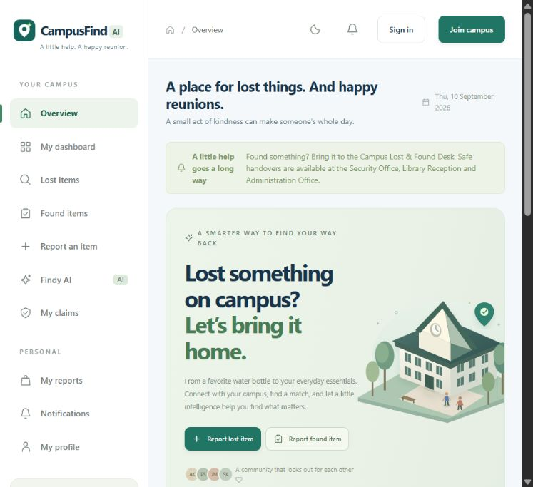
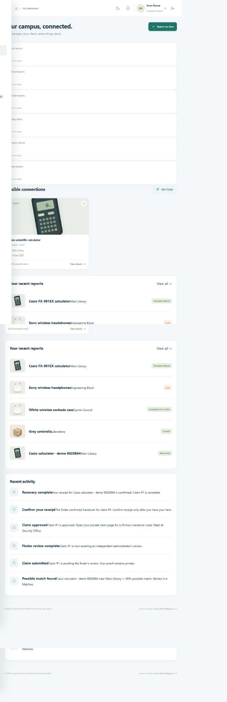
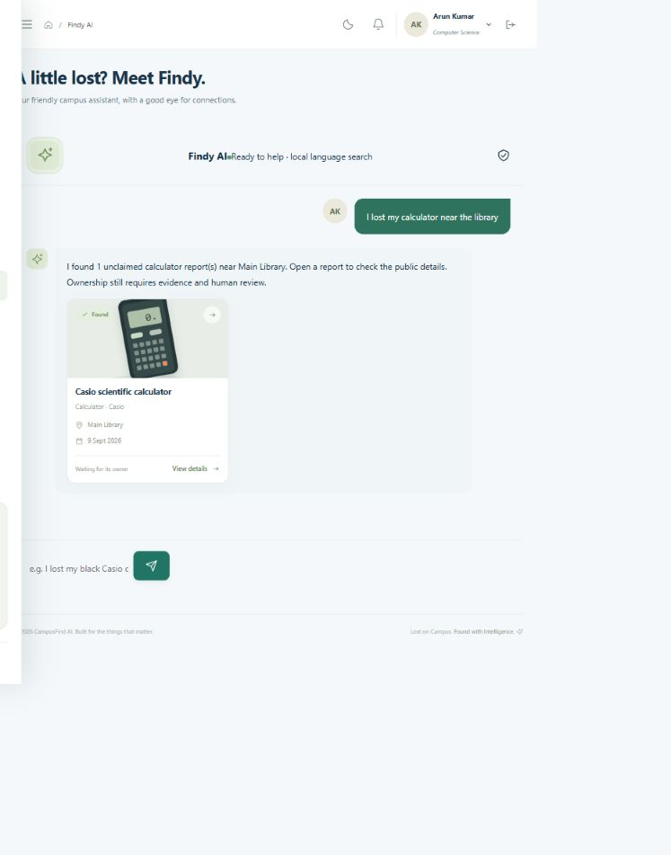
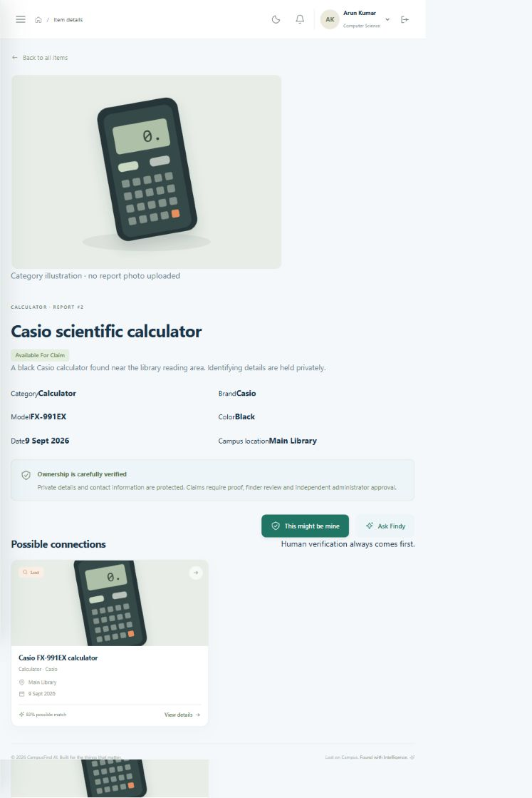
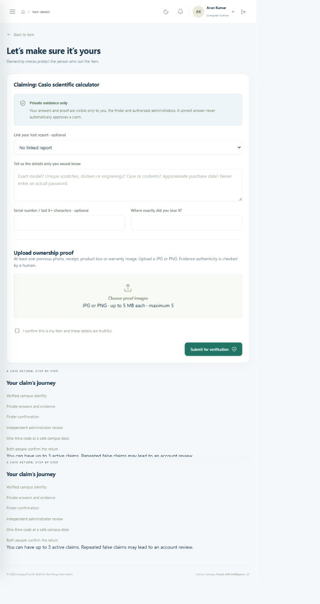
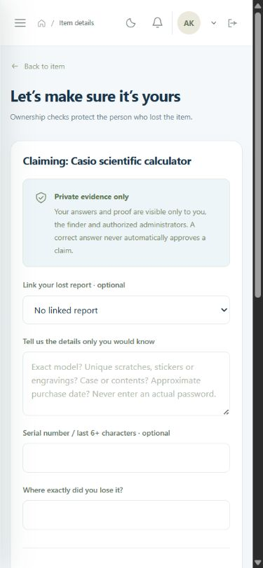
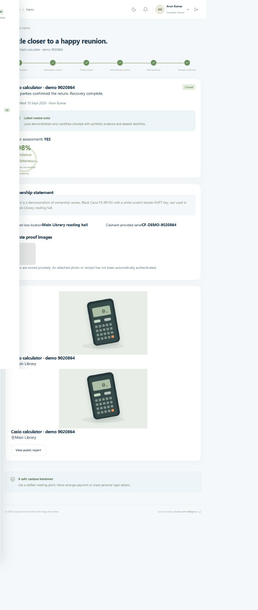
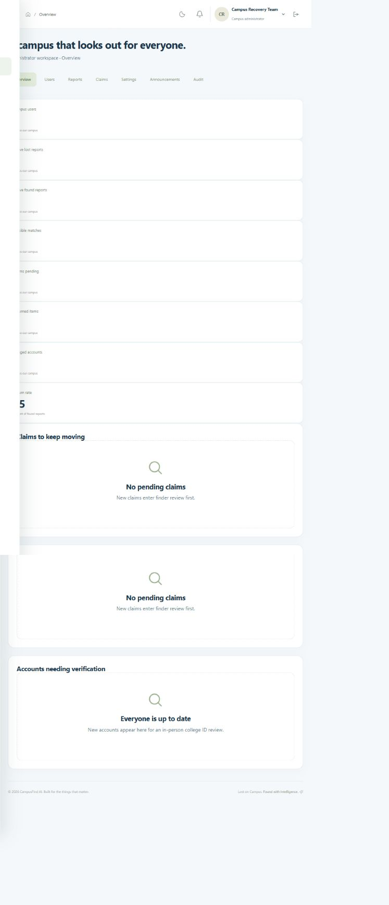
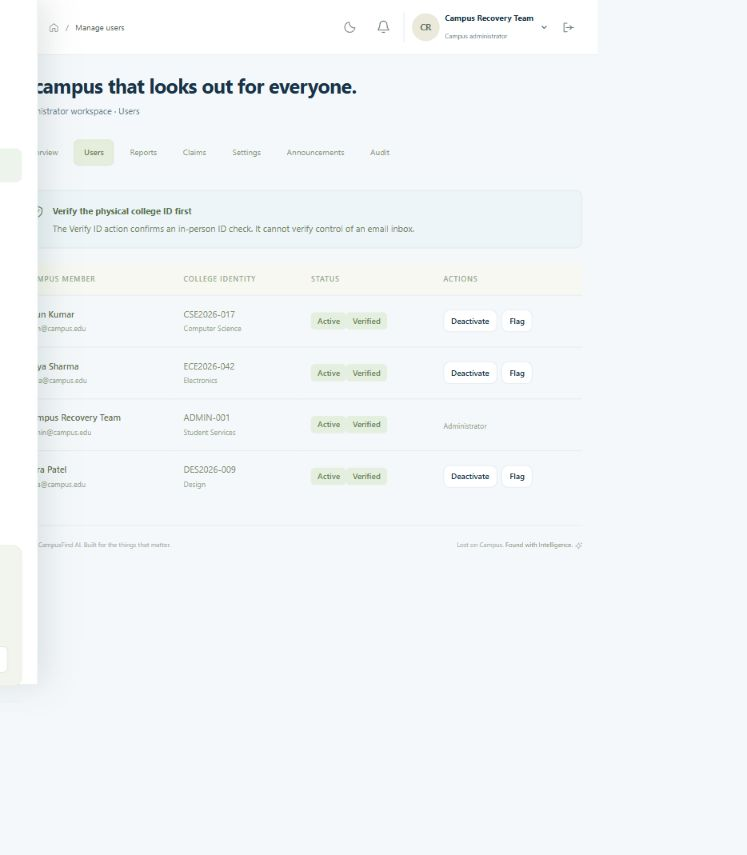

# CampusFind AI — local application screenshots

Captured from the running application on this laptop. Account information and evidence shown belong only to seeded demonstration users. No real student records are used.

## Campus overview

## Personal dashboard

## Findy database search

## Public item detail

## Ownership verification

## Mobile claim form

## Completed return

## Administrator dashboard

## Account management

